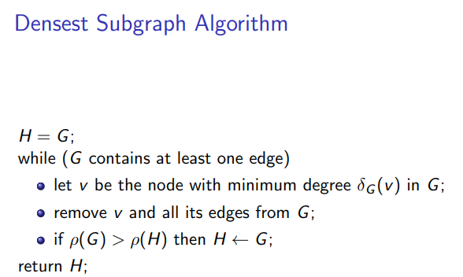

# MITRO Project

*Goal* "Implement the 2-approximation algorithm (see image below) for the densest subgraph problem. The running time of your algorithm should be linear (in
the size of the input graph) in the worst-case."

This directory contains :  
- the 5 pages report
- the complete code, with some annotations (in french).
- some relatively small graph in the format required to compute the algorithm yourself

facebook_gouv.txt, with 4039 nodes and 88234 edges
twitch_fr.txt, with 6549 nodes and 225332 edges
facebook_gouv.txt, with 7057 nodes and 89455 edges
